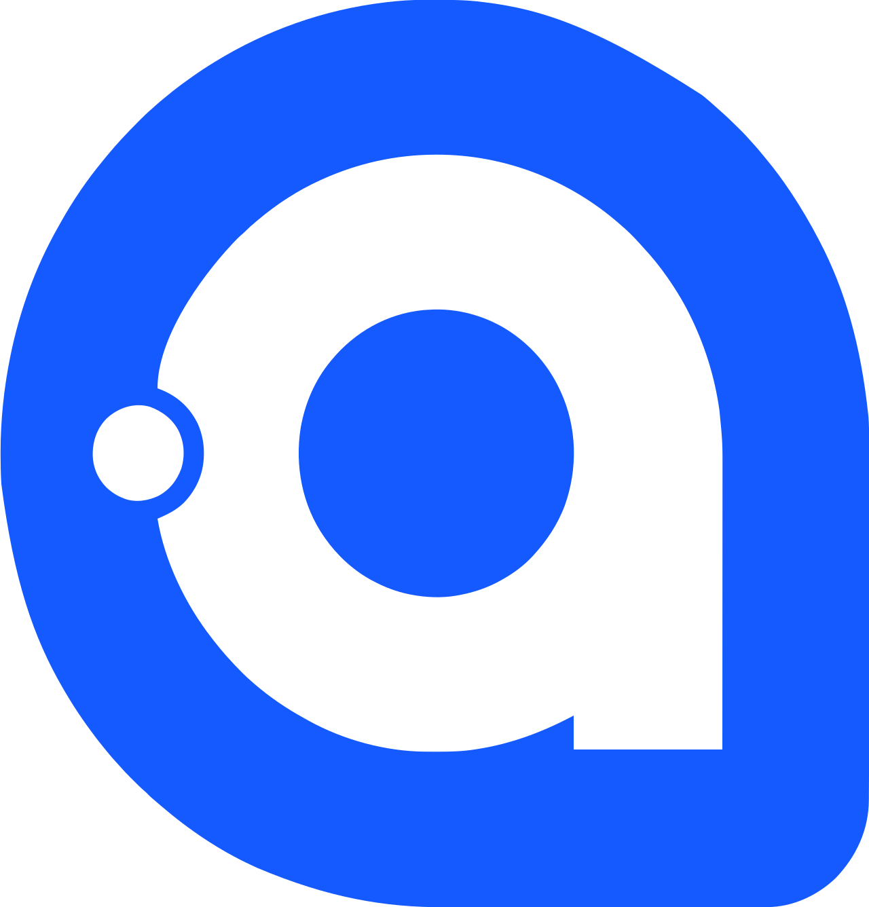

<h1 align="center">Hi there, I'm Tejas 👋 </h1>

<h3 align="center">📞 Contact Me</h3>

  
Gmail: <a href="mailto:nairstejas@gmail.com">nairstejas@gmail.com</a>

  
LinkedIn: <a href="https://www.linkedin.com/in/tejas-nair-063737299/" target="_blank" rel="noopener noreferrer">https://www.linkedin.com/in/tejas-nair-063737299/</a>

---

<h3>🛠️ My Skills</h3>

### Languages

  
  
  
  
  
  
  
  
  

### Frameworks & Technologies

  
  
  
  
  
  

### Tools & Environment

  
  
  
  
  

---

<h3>👾 What I'm Working On</h3>

### [Daedalus Engine](https://github.com/tnair3/Daedalus) `C++` `C#` `XAML` `Vulkan` `Avalonia UI`

This is my most ambitious project, an attempt to create a game engine using the Vulkan graphics API, split into 3 main modules that I can develop independently:
  
  - An application launcher, built using the Avalonia framework in C# and XAML, a  high speed entry point into the application and a project browser.
  - The project editor UI built using Dear ImGUI with the Vulkan and GLFW backends in C++.
  - The main engine logic using C++ with the Vulkan and GLFW backends for cross-platform functionality.

This project is still far from completion but is being actively worked on as I also learn about graphics programming alongside the development

### [Media Player](https://github.com/tnair3/MediaPlayer) `Kotlin` `Jetpack Compose` `Android`

A local media player application built using Kotlin that allows users to upload audio files and listen in the application. Key features include:

  - Upload and listen to audio files offline
  - Create playlists
  - Favourite songs
  - Device recording and audio trimming

This project is still in development with a number of features still incomplete or not begun, however a minimal application is complete that allows users to listen to songs with things such as playlists

### [Pacman Game](https://github.com/tnair3/NEA-A-Level-2024-25) `Python` `Pygame` `sqlite3`

This is a pacman game created for my A-Level Computer Science coursework. Made in python using the pygame library, it is designed to function similar to the classic game with further additions for the coursework. Key features include:
  
  - Standard pacman map gameplay
  - Random procedurally generated map
  - Account system
  - Leaderboard system

This project is completed and the final release can be downloaded from the repository

