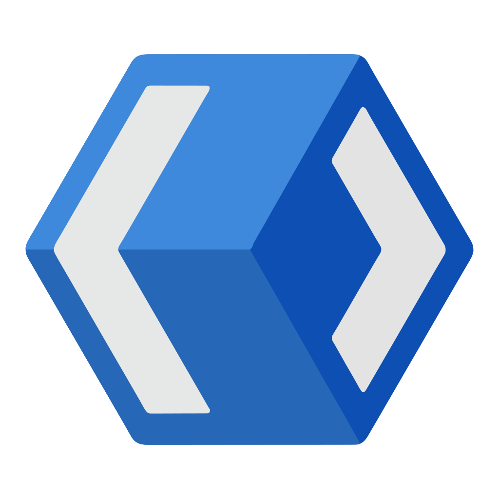
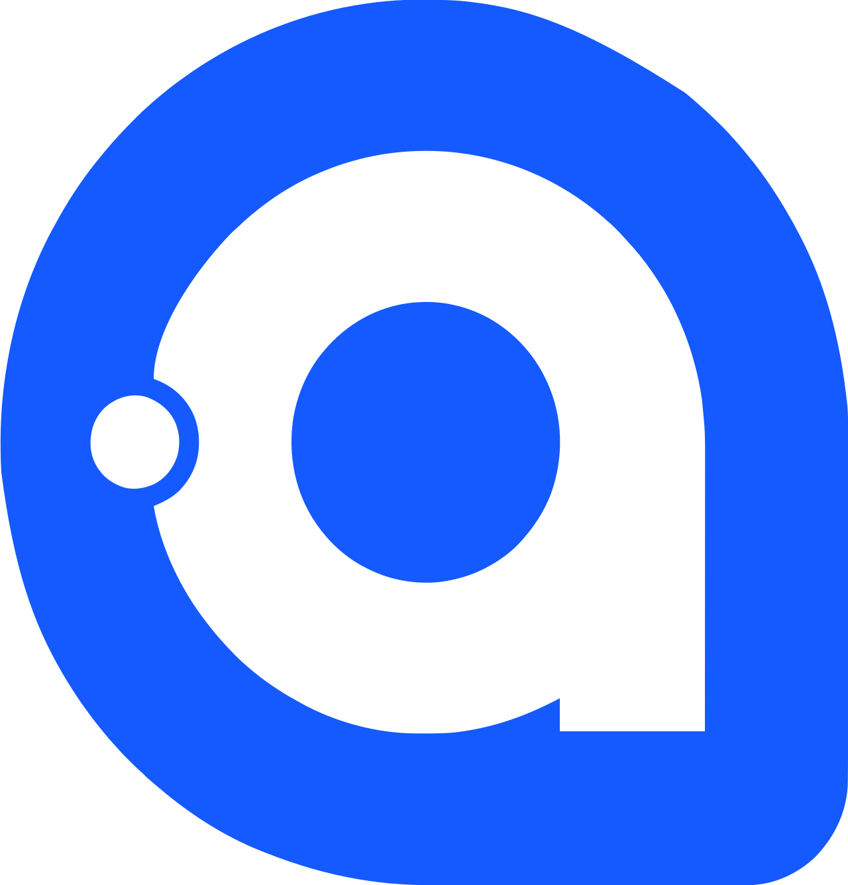

<h1 align="center">Hi, I'm Tejas 👋</h1>

<b>2nd Year Computer Science Student at King's College London</b> 

---

<h3>🛠️ My Skills</h3>

### Languages

  
  
  
  
  
  

### Frameworks & Technologies I've Used

  
  
  
  
  

### Tools & Environment

  
  
  
  
  

---

<h3>👾 Featured Projects</h3>

An ambitious game engine using the Vulkan graphics API, split into three modular components:

* **Application Launcher:** Entry point and project browser built with Avalonia UI (C# / XAML)
* **Project Editor UI:** UI built using Dear ImGui with Vulkan and GLFW backends (C++)
* **Core Engine:** Cross-platform runtime, physics, and rendering logic (C++)

 
 

A native Android media player application for offline audio playback and recording

* Upload and play local audio files offline
* Create playlists and mark favourite songs
* Integrated device recording and audio trimming features `In Development`

 
 

A Pacman game developed for A-Level Computer Science coursework featuring traditional gameplay and procedural generation

* Standard arcade gameplay alongside procedurally generated maps
* SQLite-backed user account system
* Persistent leaderboard tracking

---

### 📊 GitHub Analytics

  
  

